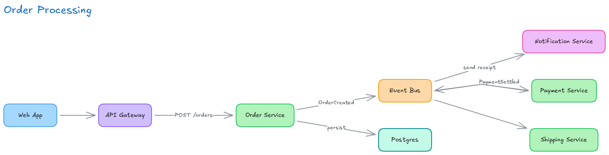
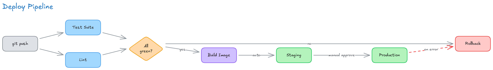
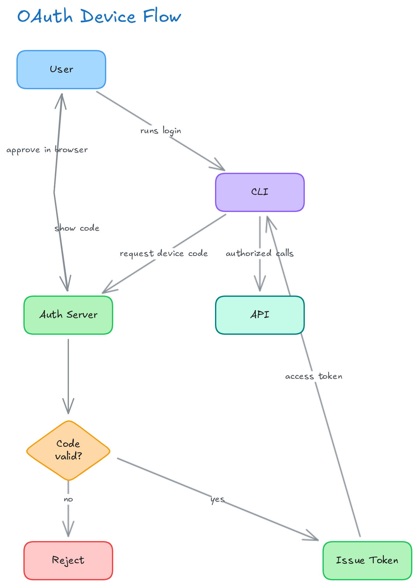

# Examples

Each diagram below is the exact output of the DSL shown with it, drawn by `draw_graph` and exported
with `export_png`. Copy a block, change the labels, and you have your own.

## Left to right: a service graph

Good default for architectures and data flows. Branches read naturally when the flow moves sideways.



```
direction LR
title 'Order Processing'
node web 'Web App' color=blue fill=blue
node gw 'API Gateway' color=purple fill=purple
node order 'Order Service' color=green fill=green
node pay 'Payment Service' color=green fill=green
node ship 'Shipping Service' color=green fill=green
node bus 'Event Bus' color=orange fill=orange
node db 'Postgres' color=teal fill=teal
node mail 'Notification Service' color=pink fill=pink
edge web -> gw
edge gw -> order 'POST /orders'
edge order -> db 'persist'
edge order -> bus 'OrderCreated'
edge bus -> pay
edge bus -> ship
edge bus -> mail 'send receipt'
edge pay -> bus 'PaymentSettled'
```

Note `pay -> bus` running back against the flow. Two edges between the same pair are bowed apart so
their labels don't collide.

## Decisions: diamonds and a failure path



```
direction LR
title 'Deploy Pipeline'
node push 'git push' color=gray fill=gray
node lint 'Lint' color=blue fill=blue
node test 'Test Suite' color=blue fill=blue
node gate 'All green?' shape=diamond color=orange fill=orange
node build 'Build Image' color=purple fill=purple
node stage 'Staging' color=green fill=green
node prod 'Production' color=green fill=green
node roll 'Rollback' color=red fill=red
edge push -> lint
edge push -> test
edge lint -> gate
edge test -> gate
edge gate -> build 'yes'
edge gate -> roll 'no'
edge build -> stage 'auto'
edge stage -> prod 'manual approve'
edge prod -> roll 'on error' color=red style=dashed
```

`shape=diamond` for a decision, `style=dashed` plus `color=red` for the path you hope never runs.

## Top to bottom: a protocol flow

`direction TB` suits sequences and anything with back-and-forth between two participants.



```
direction TB
title 'OAuth Device Flow'
node user 'User' color=blue fill=blue
node cli 'CLI' color=purple fill=purple
node auth 'Auth Server' color=green fill=green
node check 'Code valid?' shape=diamond color=orange fill=orange
node token 'Issue Token' color=green fill=green
node deny 'Reject' color=red fill=red
node api 'API' color=teal fill=teal
edge user -> cli 'runs login'
edge cli -> auth 'request device code'
edge auth -> user 'show code'
edge user -> auth 'approve in browser'
edge auth -> check
edge check -> token 'yes'
edge check -> deny 'no'
edge token -> cli 'access token'
edge cli -> api 'authorized calls'
```

`show code` and `approve in browser` run between the same two boxes in opposite directions, so they
are placed at different points along the edge to keep both readable.

## Tips

- **Give nodes short ids.** They are what you pass to `update_element` and `delete_elements` later.
- **Leave edges unlabelled when the direction says enough.** Every label competes for space.
- **Use `fill` for grouping**, not decoration. Same colour for services of the same kind reads as
  meaning.
- **Long labels are fine.** They wrap, and the box grows to fit.
