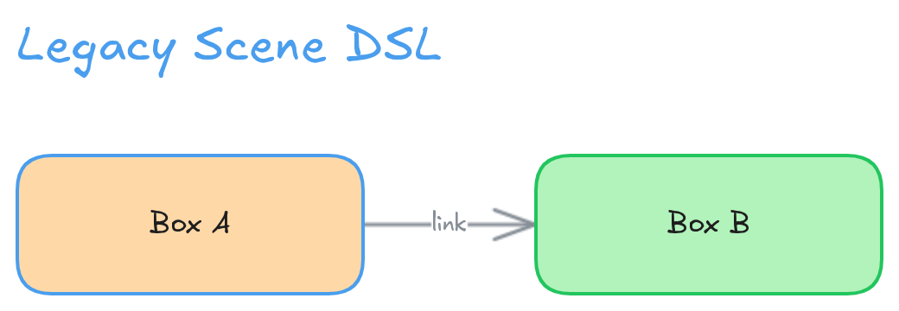

# Scene DSL — manual placement

`draw_scene` places elements at absolute coordinates. Use it for annotations, legends, callouts and
free-form sketches — anything where you want to decide exactly where things go.

For diagrams made of boxes and arrows, prefer `draw_graph`: it takes structure instead of
coordinates and runs a layout engine, so you don't have to keep boxes from colliding by hand.



```
# Comments start with #
text title 250,20 size=28 color=blue 'System Architecture'

rect frontend 100,100 200x100 color=blue fill=blue 'Frontend'
rect backend 400,100 200x100 color=green fill=green 'Backend'
arrow fe-to-be 0,0 -> 0,0 from=frontend to=backend color=gray style=dashed 'API'

diamond cache 250,280 120x80 color=orange fill=orange
circle queue 500,280 80x80 color=purple fill=purple
```

## Syntax

One element per line:

```
<type> <id> <x>,<y> [<width>x<height>] [key=value ...] ['Label'] ['Details']
```

**Always give elements a descriptive id** — `update_element`, `rename_element` and
`delete_elements` address elements by it, and `read_board` lists them. Without one, elements get
generated ids like `el-1744123456789-0`.

| Type | Form |
|------|------|
| `rect`, `circle`, `diamond` | `rect api 100,100 200x80 color=blue fill=blue 'Label'` |
| `text` | `text title 250,20 size=28 color=blue 'Heading'` |
| `arrow`, `line` | `arrow a1 100,150 -> 400,150 color=gray 'Label'` |

## Options

| Key | Values |
|-----|--------|
| `color` | `red` `blue` `green` `orange` `purple` `pink` `yellow` `gray` `black`, or a hex code |
| `fill` | same set — pastel background matching the stroke colour |
| `size` | font size (text elements and labels) |
| `style` | `solid` `dashed` `dotted` (arrows and lines) |
| `start` / `end` | `arrow` `bar` `dot` `triangle` `none` (arrowheads) |
| `name` | alternative way to set the id: `rect 100,100 name=api` |

## Bound arrows

Give an arrow `from=` and `to=` with element ids and the endpoints are computed from the shape
edges — the coordinates are then ignored, so `0,0 -> 0,0` is the convention:

```
rect a 100,100 180x80 color=blue fill=blue 'Service A'
rect b 400,100 180x80 color=green fill=green 'Service B'
arrow a-to-b 0,0 -> 0,0 from=a to=b color=gray 'calls'
```

The arrow stays bound to both shapes, so it follows if you drag them around in the editor.

## Labels and details

A second quoted string becomes a detail block under the title. Use `|` without surrounding spaces
for line breaks:

```
rect api 400,100 200x100 color=green fill=green 'Backend' 'Express|Node 22'
```

## Modes

`mode=replace` clears the board first; `mode=append` (the default) adds to what is there.

## Layout guidance

Since you own the geometry here: minimum 150×80 for a labelled shape, at least 30px between
elements, font size 16 for labels and 20+ for titles. Fewer, larger elements read better than many
small ones.
