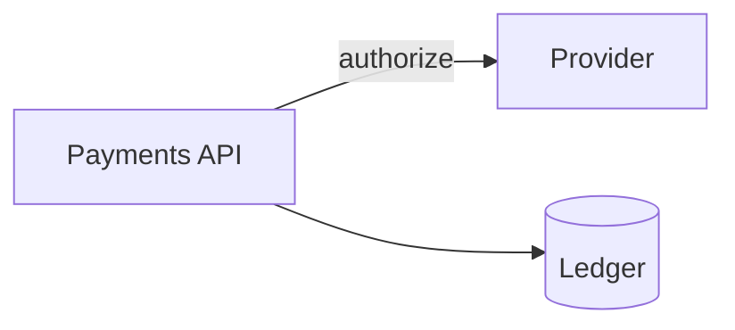

# Drawing diagrams that hold up

## Start with `draw_mermaid`

`draw_scene` wants pixel coordinates. Placing boxes by coordinate is the thing models are worst at,
and it shows: overlapping boxes, arrows through unrelated shapes, captions on top of things.

Use `draw_mermaid` for architectures, flows, sequences, class diagrams, state machines and ER
diagrams. It uses Excalidraw's official converter and produces native, editable elements:



Mermaid is processed locally. Supported editable forms are `flowchart`, `sequenceDiagram`,
`classDiagram`, `stateDiagram` and `erDiagram`. Other Mermaid types may only have a flat image
representation; the MCP refuses those instead of silently creating a non-editable board.

`draw_graph` remains a compact option for a small node/edge graph:

```
direction LR
node api 'Payments API' color=blue fill=blue
node psp 'Provider' color=purple fill=purple
edge api -> psp 'authorize'
```

Reach for `draw_scene` only for things that are not a graph: a legend, an annotation, a sketch.

## Look at what you drew

Call `export_png` and actually open the image before you say you are done. Geometry that reads fine
as JSON can look wrong on screen, and it is the only way to catch a caption sitting on a box or a
diagram that came out lopsided. This is the single highest-value habit here.

## Keep labels short

Two rules, both about the same thing:

- **Node labels: a few words.** The box is sized from its label and wraps past roughly 260px. Long
  labels give you tall, uneven boxes that make the whole diagram look untidy.
- **Edge labels: two or three words.** An edge label sits at the middle of its arrow. A long one
  reaches far enough sideways to land on a neighbouring box. `on failure` is fine, `retries with
  exponential backoff up to 5 times` is not. Put that detail in the node label or leave it out.

## Pick the direction from the shape of the graph

`flowchart LR` for pipelines and request flows, `flowchart TB` for hierarchies, trees and decision
flows. The compact graph DSL uses `direction LR` and `direction TB`. If a diagram comes out extreme,
flip the direction and redraw.

## Mermaid constraints

- Avoid duplicate identical edges between the same two nodes when one labelled edge communicates
  the relationship more clearly.
- Keep subgraphs modest. If the upstream converter cannot preserve a diagram as editable elements,
  `draw_mermaid` returns an error and leaves the board untouched.
- Mermaid does layout, not semantic editing. To make a structural change, edit the Mermaid source
  and call `draw_mermaid` again with `mode=replace`.

## Compact graph DSL constraints

- **A shortcut past the middle of a chain.** With `a -> b -> c` and also `a -> c`, the shortcut has
  to get past `b`. The arrow stays straight and `b` steps aside instead, which widens the drawing.
  If the result looks lopsided, ask whether that edge earns its place.
- **More than two edges between the same pair.** They fan apart and the labels crowd. Usually one
  edge with a combined label reads better.
- **Self-loops** are drawn as a loop off the right-hand side of the node, with the label beside it.
  One reads fine; several on the same node draw on top of each other.
- **Long labels in a diamond.** Excalidraw gives a diamond's label only half the shape's width, so a
  diamond is always about 1.6x wider than a rectangle holding the same text, and a single long word
  sets a floor nothing can go below. Decision nodes want two or three words — `Gueltig?`,
  `Cache leer oder alt?` — not a sentence.

## Two footguns

- `draw_mermaid` and `draw_graph` default to `mode=replace`, which clears only the elements this server drew before — anything drawn by hand stays. Pass `mode=append` to add without clearing, or `mode=wipe` to empty the board completely.
- Give every element an id in `draw_scene` (`rect frontend 100,100 ...`). Without one you cannot
  `update_element` or `delete_elements` later without redrawing everything.

## Colour means something or nothing

Use three or four, and let each carry a meaning: one per layer, per team, per lifecycle stage. Red
for the failure path reads instantly. Red because the box needed a colour reads as noise.

Safe in both `color=` and `fill=`: blue, green, orange, purple, red, yellow, pink, gray, amber,
cyan, lime. Two exceptions worth knowing: `teal` is a fill only, `black` and `white` are strokes
only. The others fall through to CSS, so they render but not in the palette's tone.

One real trap: `orange`, `yellow` and `amber` are three different fills but the **same** stroke.
Three boxes meant to be told apart by outline will look identical.
